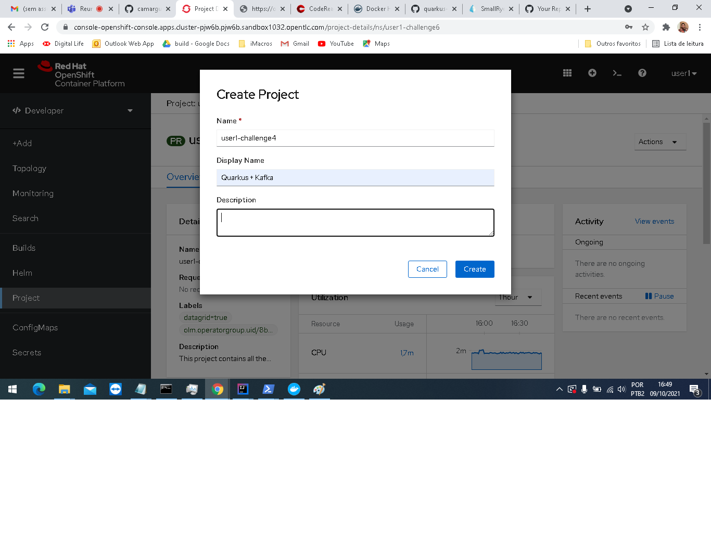
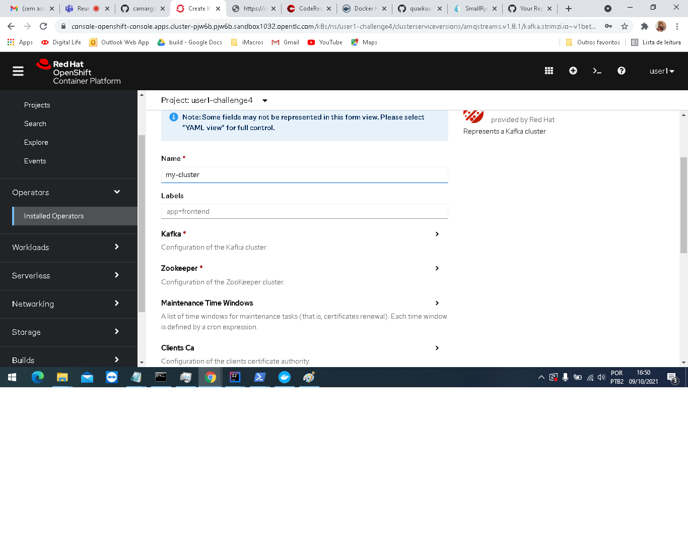
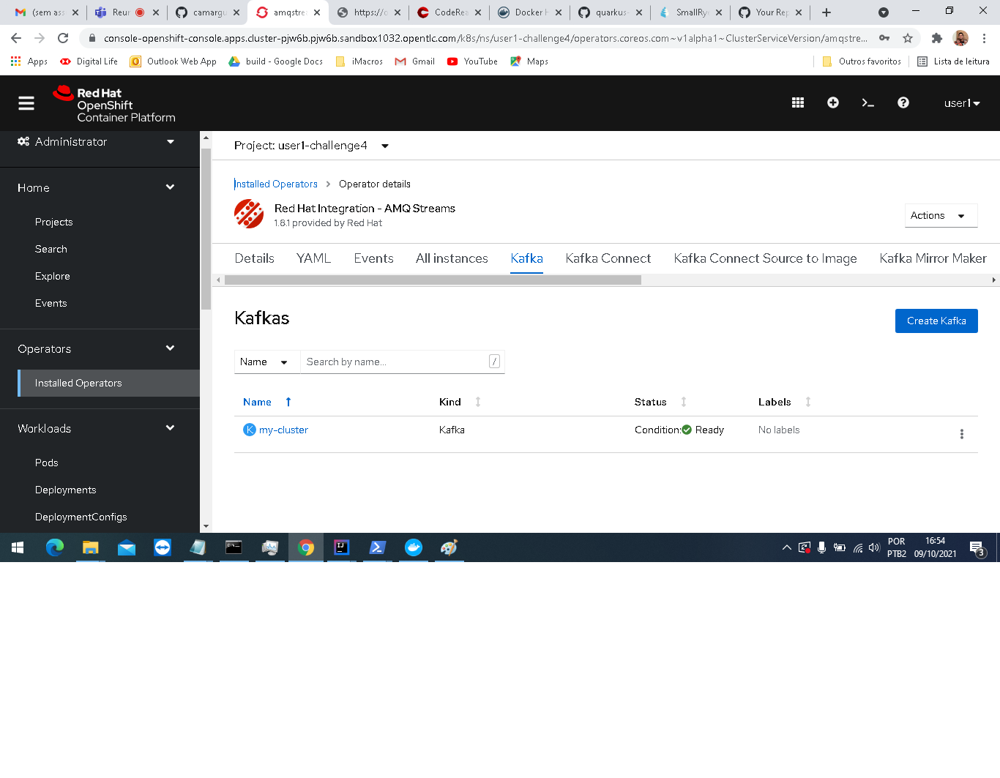
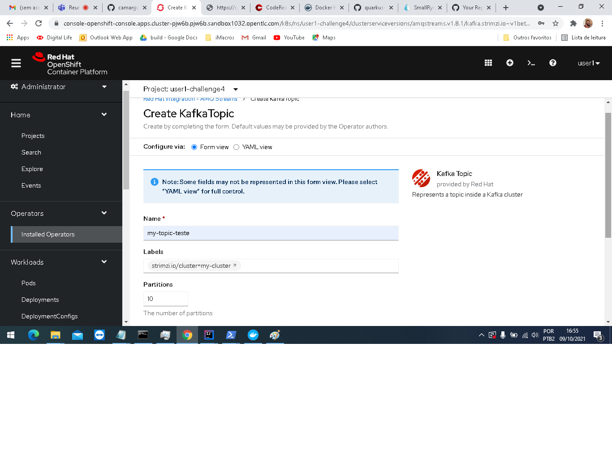
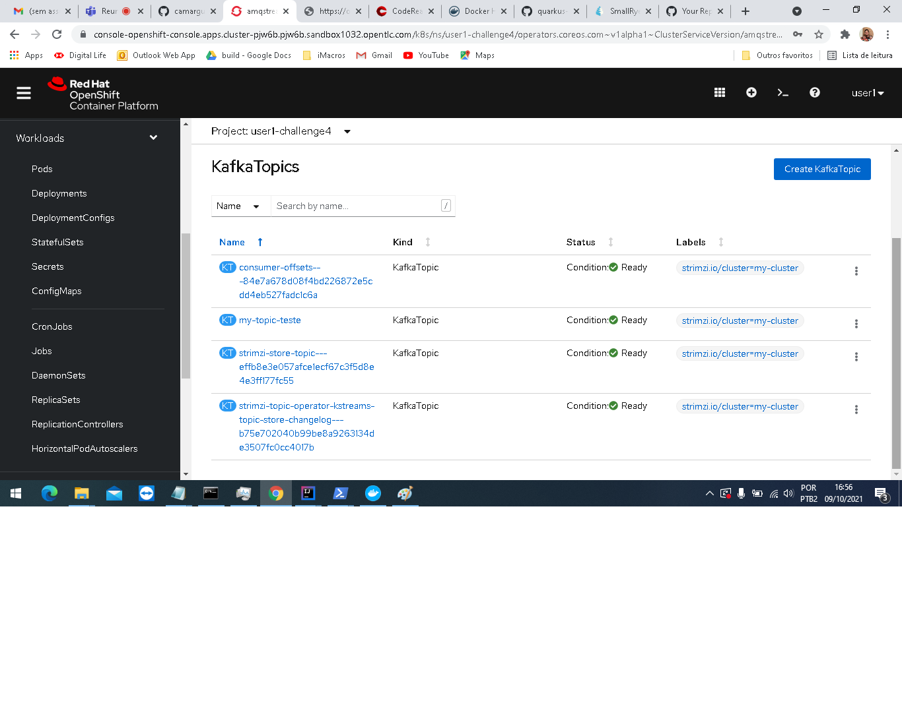
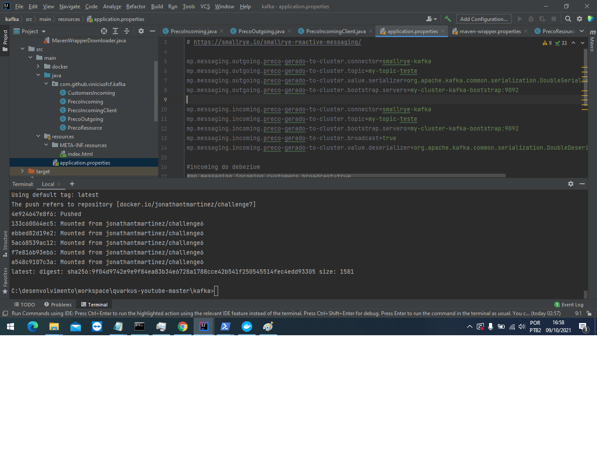
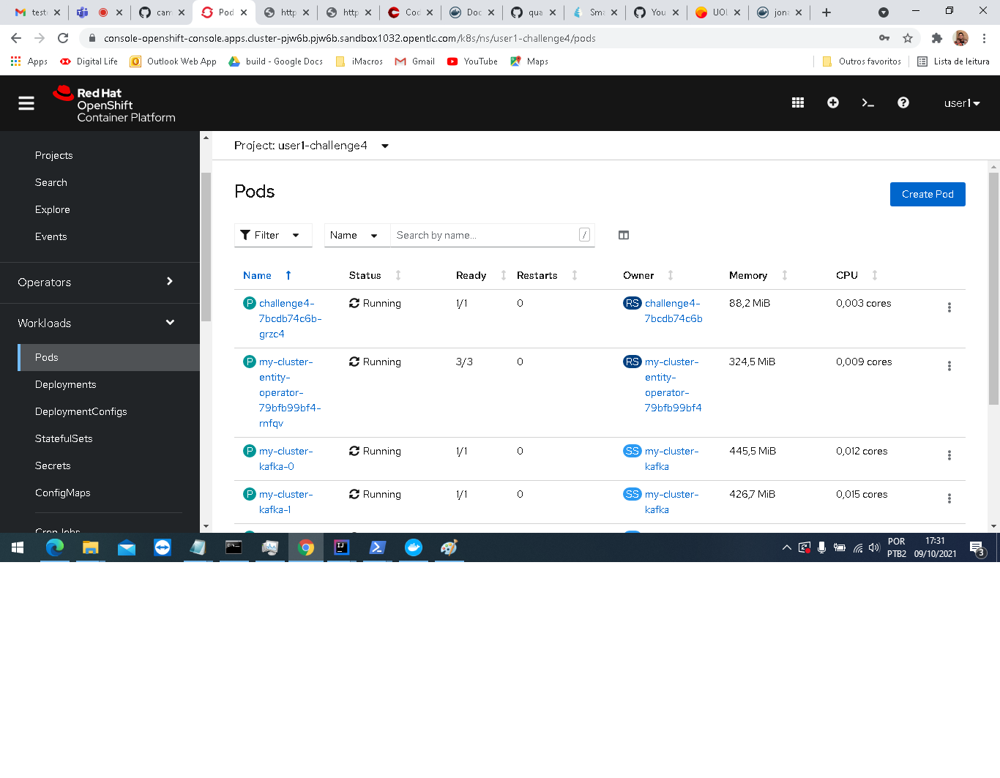
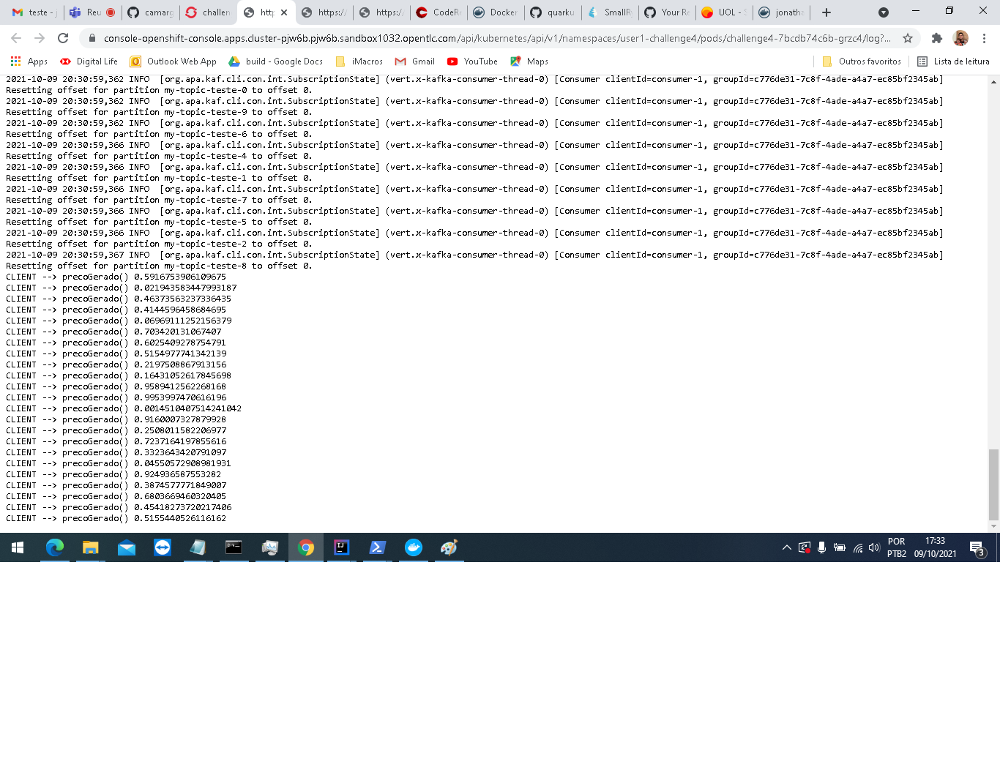

# Challenge 4 Evidence
## EDA with Quarkus and Apache Kafka

Step 1: Create project

Step 2: Create kafka cluster

Step 3: Cluster created

Step 4: Create topic

Step 5: Topic created

Step 6 - Configuring bootstrap application

Step 7 - Pod evidence running

Step 8 - Pod log - Production and consumption of events on the topic

